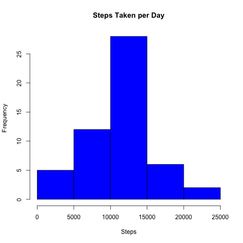
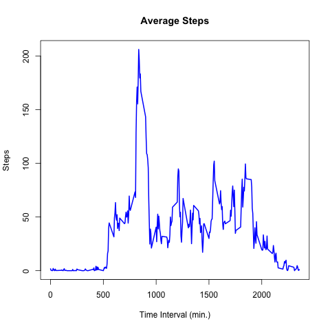
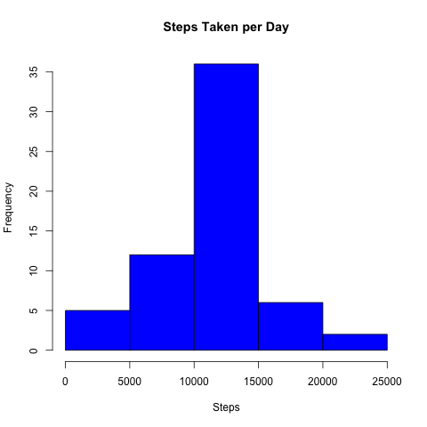
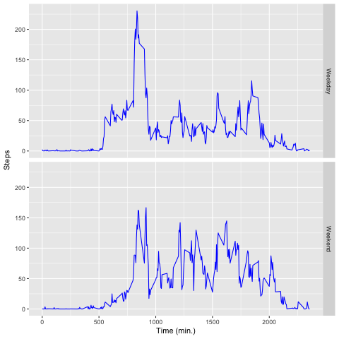

## Loading and preprocessing the data

First, we will load some libraries that will be useful to us in our exploratory analysis.

```{r setup, include=FALSE}
library(knitr)
library(dplyr)
library(ggplot2)
```

And, we will load the data and process the data into a format suitable for our analysis.

```{r 1a}
## Load the raw data
activity <- read.csv("/Users/dariuskharazi/Downloads/activity.csv", 
                     colClasses = c("numeric", "Date", "numeric"))
```

## What is the mean total number of steps taken per day

For this part of our analysis, we will ignore the missing values in the dataset for now. We will now calculate the total number of steps taken per day.

```{r 2a}
## Calculate the total number of steps taken per day
dailySteps <- activity %>% 
  group_by(date) %>%
  summarise(steps = sum(steps))
```

Next, we will create a histogram of the total number of steps taken each day.

```{r 2b}
## Create a histrogram
hist(dailySteps$steps, col = "blue", main = "Steps Taken per Day", xlab = "Steps")
```



And, we will calculate the mean and median of the total number of steps taken per day.

```{r 2c}
## Calculate the mean and median
c(mean = mean(dailySteps$steps, na.rm = TRUE),
  median = median(dailySteps$steps, na.rm = TRUE))
```

## What is the average daily activity pattern

For this part of our analysis, we will make a time series plot of the 5-minute interval (x-axis) and the average number of steps taken, averaged across all days (y-axis).

```{r 3a}
## Calculate the average steps at each 5-minute interval
meanSteps <- activity %>% 
  group_by(interval) %>%
  summarise(steps = mean(steps, na.rm = TRUE))

## Create a time series plot
plot(meanSteps$interval, meanSteps$steps,
     type = "l", col = "blue", lwd = 2,
     main = "Average Steps", xlab = "Time Interval (min.)", ylab = "Steps")
```



Now, we will determine which 5-minute interval contains the maximum number of average steps.

```{r 3b}
## Find the interval with the max number of steps
meanSteps[meanSteps$steps == max(meanSteps$steps) ,1]
```

## Imputing missing values

Note that there are a number of days and 5-minute intervals where there are missing values. The presence of missing days may introduce bias into some calculations or summaries of the data. Therefore, we should think about imputing these missing values to create more accurate data summaries. In order to do this, we should first calculate and report the total number of missing values in the dataset.

```{r 4a}
## Calculate the total number of missing values
colSums(is.na(activity))
```

We can see that there are thousands of missing step values, which is a problem. We'll need to devise a strategy for filling in all of the missing values in the dataset. The strategy does not need to be sophisticated. For example, we could use the mean or median number of steps for that day, or we could use the mean for that 5-minute interval. In this scenario, I chose to replace the missing step values with the mean number of steps for that day, but the other options are fine too!

```{r 4b}
## Replace missing values with median
activity <- inner_join(activity, meanSteps, by = "interval")
activity$steps.x <- with(activity, ifelse(is.na(steps.x), steps.y, steps.x))
activity <- activity[,c(1:3)]
names(activity) <- c("steps", "date", "interval")
```

Next, we will create a histogram of the total number of steps taken each day, and we will calculate the mean and median total number of steps taken per day. Now that we have imputed the missing step values, we will see that our histogram will look slightly different from our previous histogram, since we've replaced the missing step values with the mean number of steps.

```{r 4c}
## Calculate the total number of steps taken per day
dailySteps <- activity %>% 
  group_by(date) %>%
  summarise(steps = sum(steps))

## Create a histogram
hist(dailySteps$steps, col = "blue", main = "Steps Taken per Day", xlab = "Steps")
```



## Are there differences in activity patterns between weekdays and weekends?

For the final part of our analysis, we will use the dataset with the filled-in missing values, and we will create a new factor variable in the dataset with two levels – "weekday" and "weekend" - indicating whether a given date is a weekday or weekend day.

```{r 5a}
## Create a new factor variable
activity$weekday <- ifelse(weekdays(activity$date) %in% c("Saturday", "Sunday"), "weekend", "weekday")
```

Lastly, we will create a panel plot containing a time series plot of the 5-minute interval and the average number of steps taken, which will be averaged across all weekdays and weekends.

```{r 5b}
## Calculate the average number of steps taken
meanSteps <- activity %>% 
  group_by(weekday, interval) %>%
  summarise(steps = mean(steps))

## Create a panel plot
ggplot(meanSteps, aes(interval, steps)) +
  geom_line(color = "blue") +
  labs(x = "Time (min.)", y = "Steps") +
  facet_grid(weekday~., 
             labeller = as_labeller(c("weekday" = "Weekday", "weekend" = "Weekend"))) 
```


